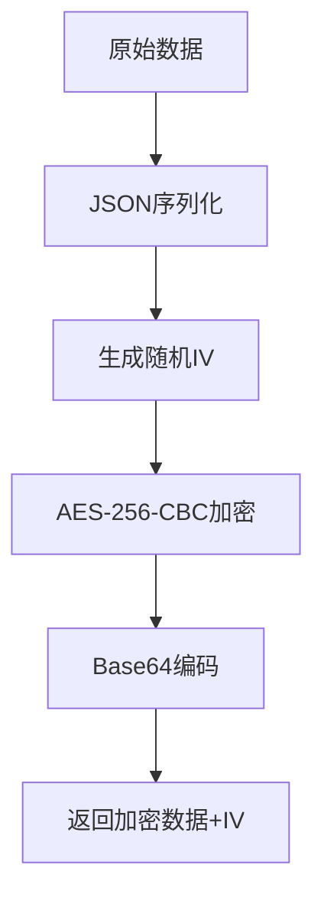
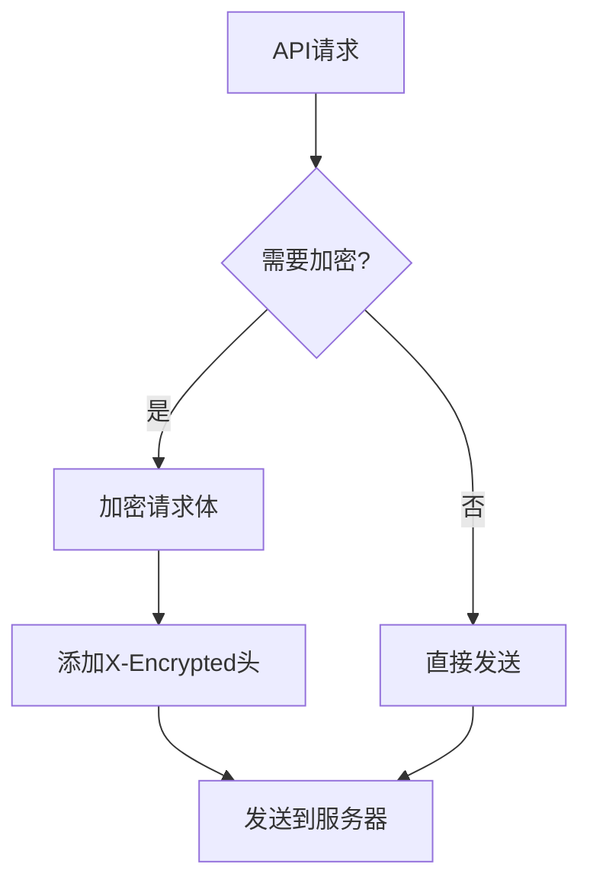

# API 加密功能文档

## 概述

本项目实现了基于 [ruoyi-vue-plus API加密方案](https://plus-doc.dromara.org/#/ruoyi-vue-plus/framework/extend/api_encrypt) 的前端数据加密功能，使用混合加密方案（RSA + AES）确保敏感数据在传输过程中的安全性。

## 功能特性

### 🔐 混合加密方案
- **RSA + AES 混合加密**：登录接口使用RSA加密AES密钥，AES加密数据
- **RSA 加密算法**：用于加密AES密钥，非对称加密更安全
- **AES 加密算法**：用于加密实际数据，对称加密性能更好
- **Base64编码**：便于网络传输
- **动态密钥**：每次请求生成新的AES密钥

### 🛡️ 安全特性
- **密钥管理**：支持动态密钥配置
- **加密标识**：自动添加 `X-Encrypted` 请求头
- **错误处理**：完善的加密/解密错误处理机制
- **配置持久化**：加密配置本地存储

## 文件结构

```
utils/
├── rsaCrypto.ts          # RSA加密工具
├── aesCrypto.ts          # AES加密工具
├── hybridCryptoTest.ts   # 混合加密测试
├── encryptionConfig.ts   # 加密配置管理
└── encryptionTest.ts     # 加密功能测试

config/
└── api.ts               # API配置（包含RSA密钥）

services/
├── apiClient.ts         # API客户端（支持混合加密）
└── authApi.ts          # 认证API（使用混合加密登录）

docs/
└── ENCRYPTION.md       # 本文档
```

## 核心API

### RSA加密工具 (`utils/rsaCrypto.ts`)

```typescript
// 加密数据
function encryptData(data: any): string

// 解密数据
function decryptData(encryptedData: string): any

// 使用RSA公钥加密字符串（用于加密AES密钥）
function encryptWithRSA(data: string): string

// 生成密钥对（测试用）
function generateKeyPair(): { publicKey: string; privateKey: string }

// 验证密钥有效性
function validateKeys(): boolean

// 测试RSA加密功能
function testRSAEncryption(): boolean
```

### AES加密工具 (`utils/aesCrypto.ts`)

```typescript
// 生成AES密钥
function generateAesKey(): string

// 使用AES密钥加密数据
function encryptWithAes(data: any, key: string): string

// 使用AES密钥解密数据
function decryptWithAes(encryptedData: string, key: string): any

// Base64编码
function encryptBase64(data: string): string

// Base64解码
function decryptBase64(data: string): string

// 测试AES加密功能
function testAESEncryption(): boolean
```

### 混合加密测试 (`utils/hybridCryptoTest.ts`)

```typescript
// 测试混合加密功能（RSA + AES）
function testHybridEncryption(): boolean

// 测试登录接口的完整加密流程
function testLoginEncryptionFlow(): boolean

// 模拟后端解密流程（用于验证）
function simulateBackendDecryption(encryptedData: string, encryptedAesKey: string): any
```

### 加密配置 (`utils/encryptionConfig.ts`)

```typescript
// 获取加密配置
async function getEncryptionConfig(): Promise<EncryptionConfig>

// 保存加密配置
async function setEncryptionConfig(config: EncryptionConfig): Promise<void>

// 从服务器获取配置
async function fetchEncryptionConfigFromServer(): Promise<EncryptionConfig>
```

### API客户端 (`services/apiClient.ts`)

```typescript
// 普通POST请求
async post<T>(endpoint: string, data?: any, headers?: Record<string, string>): Promise<ApiResponse<T>>

// 加密POST请求
async postEncrypted<T>(endpoint: string, data?: any, headers?: Record<string, string>): Promise<ApiResponse<T>>
```

## 使用示例

### 1. 基本加密使用

```typescript
import { encryptData, decryptData } from '../utils/crypto';

// 加密数据
const data = { username: 'admin', password: '123456' };
const encrypted = await encryptData(data);
console.log('加密结果:', encrypted);

// 解密数据
const decrypted = decryptData(encrypted.data, encrypted.iv);
console.log('解密结果:', decrypted);
```

### 2. API请求加密

```typescript
import { apiClient } from '../services/apiClient';

// 普通请求
const response1 = await apiClient.post('/api/data', { key: 'value' });

// 加密请求
const response2 = await apiClient.postEncrypted('/api/sensitive', { 
  username: 'admin', 
  password: 'secret' 
});
```

### 3. 登录数据加密

```typescript
// 登录API自动使用加密
const loginData = {
  username: 'admin',
  password: 'password123',
  captcha: 'ABCD',
  captchaId: 'uuid-1234'
};

const response = await authApi.login(loginData);
```

## 加密流程

### 1. 数据加密流程



### 2. API请求流程



## 配置说明

### 默认配置

```typescript
const DEFAULT_CONFIG = {
  secretKey: 'score-app-2024-default',
  algorithm: 'AES',
  mode: 'CBC',
  padding: 'PKCS7',
  keySize: 256,
  ivSize: 128,
};
```

### 服务器配置获取

```typescript
// 从服务器获取最新加密配置
const config = await fetchEncryptionConfigFromServer();
```

## 安全建议

### 1. 密钥管理
- ✅ 使用强密钥（至少32字符）
- ✅ 定期轮换密钥
- ✅ 从服务器动态获取密钥
- ❌ 避免硬编码密钥

### 2. 传输安全
- ✅ 始终使用HTTPS
- ✅ 验证服务器证书
- ✅ 添加请求签名验证

### 3. 错误处理
- ✅ 记录加密/解密错误
- ✅ 不暴露敏感错误信息
- ✅ 实现重试机制

## 测试功能

### 运行加密测试

```typescript
import { testEncryption, testLoginEncryption } from '../utils/encryptionTest';

// 基本加密测试
const success = await testEncryption();

// 登录数据加密测试
const encrypted = await testLoginEncryption();
```

## 故障排除

### 常见问题

1. **加密失败**
   - 检查密钥是否正确
   - 确认数据格式是否有效
   - 查看控制台错误信息

2. **解密失败**
   - 验证IV是否正确
   - 确认密钥是否匹配
   - 检查数据完整性

3. **网络请求失败**
   - 确认服务器支持加密
   - 检查请求头设置
   - 验证数据格式

### 调试模式

```typescript
// 启用详细日志
console.log('🔒 加密前:', originalData);
console.log('🔓 加密后:', encryptedData);
console.log('📤 发送数据:', serverPayload);
```

## 更新日志

- **v1.0.0** - 初始版本，支持AES-256-CBC加密
- **v1.1.0** - 添加动态配置管理
- **v1.2.0** - 集成到API客户端
- **v1.3.0** - 添加UI状态指示器

## 参考文档

- [ruoyi-vue-plus API加密文档](https://plus-doc.dromara.org/#/ruoyi-vue-plus/framework/extend/api_encrypt)
- [CryptoJS官方文档](https://cryptojs.gitbook.io/)
- [AES加密标准](https://en.wikipedia.org/wiki/Advanced_Encryption_Standard)
